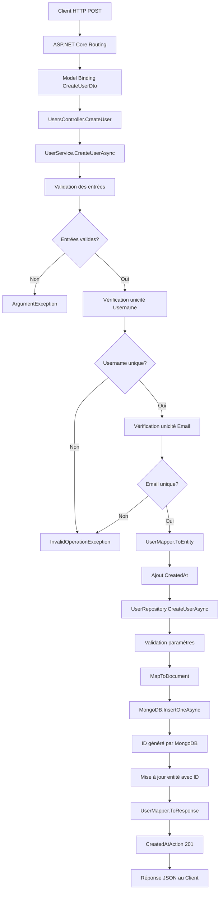

# Analyse détaillée de la méthode CreateUser du UsersController

**Dernière mise à jour :** 2025-11-01  
**Fichier analysé :** `PolyglotteBackend\Polyglotte.API\Controllers\UsersController.cs`  
**Méthode :** `CreateUser(CreateUserDto createUserDto)`

## Vue d'ensemble

Ce document analyse étape par étape le processus complet de la méthode `CreateUser` du `UsersController`, depuis la réception de la requête HTTP jusqu'à la réponse renvoyée au client. Cette méthode implémente l'architecture Clean Architecture avec validation métier intégrée dans le service.

## Signature de la méthode

```csharp
[HttpPost]
public async Task<ActionResult<UserResponse>> CreateUser(CreateUserDto createUserDto)
```

### Attributs et paramètres
- **`[HttpPost]`** : Indique que cette méthode répond aux requêtes HTTP POST
- **`async Task<ActionResult<UserResponse>>`** : Méthode asynchrone qui retourne une réponse HTTP typée
- **`CreateUserDto createUserDto`** : DTO désérialisé automatiquement depuis le JSON de la requête

## Analyse étape par étape du processus

### Étape 1 : Réception de la requête HTTP

```http
POST /api/users
Content-Type: application/json

{
  "username": "johndoe",
  "email": "john.doe@example.com"
}
```

**Ce qui se passe :**
- ASP.NET Core reçoit la requête HTTP POST sur l'endpoint `/api/users`
- Le routage identifie la méthode `CreateUser` du `UsersController`
- Le model binder désérialise automatiquement le JSON en objet `CreateUserDto`
- Aucune validation explicite n'est effectuée au niveau du contrôleur

**Structure du DTO :**
```csharp
public class CreateUserDto
{
    public string Username { get; set; } = string.Empty;
    public string Email { get; set; } = string.Empty;
}
```

### Étape 2 : Appel du service métier

```csharp
var user = await _userService.CreateUserAsync(createUserDto);
```

**Ce qui se passe :**

1. **Injection de dépendance :**
   - `_userService` est de type `IUserService`
   - Implémentation concrète : `UserService`

2. **Traitement dans UserService.CreateUserAsync :**

#### Sous-étape 2.1 : Validation des entrées
```csharp
// Validation des entrées
if (string.IsNullOrWhiteSpace(createUserDto.Username))
    throw new ArgumentException("Username cannot be null or empty", nameof(createUserDto.Username));

if (string.IsNullOrWhiteSpace(createUserDto.Email))
    throw new ArgumentException("Email cannot be null or empty", nameof(createUserDto.Email));
```

**Vérifications effectuées :**
- Le nom d'utilisateur ne doit pas être null, vide ou composé uniquement d'espaces
- L'email ne doit pas être null, vide ou composé uniquement d'espaces
- Si une validation échoue : `ArgumentException` est levée

#### Sous-étape 2.2 : Vérification d'unicité
```csharp
// Vérification d'unicité
if (await _userRepository.UsernameExistsAsync(createUserDto.Username))
    throw new InvalidOperationException($"Username '{createUserDto.Username}' already exists");

if (await _userRepository.EmailExistsAsync(createUserDto.Email))
    throw new InvalidOperationException($"Email '{createUserDto.Email}' already exists");
```

**Vérifications effectuées :**
- Appel asynchrone à `UsernameExistsAsync` pour vérifier l'unicité du username
- Appel asynchrone à `EmailExistsAsync` pour vérifier l'unicité de l'email
- Si un conflit existe : `InvalidOperationException` est levée

#### Sous-étape 2.3 : Mapping DTO vers Entité Domain
```csharp
var user = _userMapper.ToEntity(createUserDto);
user.CreatedAt = DateTime.UtcNow;
```

**Transformation effectuée par UserMapper.ToEntity :**
```csharp
public User ToEntity(CreateUserDto dto)
{
    return new User
    {
        Username = dto.Username,
        Email = dto.Email
    };
}
```

**Ce qui se passe :**
- `CreateUserDto` → `User` (entité Domain)
- Ajout manuel de `CreatedAt` avec l'heure UTC actuelle
- L'`Id` reste vide (sera généré par MongoDB)

### Étape 3 : Persistance via Repository

```csharp
await _userRepository.CreateUserAsync(user);
```

**Ce qui se passe dans UserRepository.CreateUserAsync :**

#### Sous-étape 3.1 : Validation des paramètres
```csharp
if (user == null)
    throw new ArgumentNullException(nameof(user));
```

#### Sous-étape 3.2 : Conversion vers Document MongoDB
```csharp
private static UserDocument MapToDocument(User entity)
{
    return new UserDocument
    {
        Username = entity.Username,
        Email = entity.Email,
        CreatedAt = entity.CreatedAt
    };
}
```

**Structure du UserDocument :**
```csharp
public class UserDocument
{
    [BsonId]
    public ObjectId Id { get; set; }

    [BsonElement("username")]
    public string Username { get; set; }

    [BsonElement("email")]
    public string Email { get; set; }

    [BsonElement("createdAt")]
    public DateTime CreatedAt { get; set; }
}
```

#### Sous-étape 3.3 : Insertion en base MongoDB
```csharp
var userDocument = MapToDocument(user);
await _users.InsertOneAsync(userDocument);

// Update the entity with the generated ID
user.Id = userDocument.Id.ToString();
```

**Ce qui se passe :**
- Insertion du document dans la collection MongoDB `users`
- MongoDB génère automatiquement un `ObjectId` unique
- Mise à jour de l'entité Domain avec l'ID généré (conversion ObjectId → string)

### Étape 4 : Mapping Entité vers DTO de réponse

```csharp
return _userMapper.ToResponse(user);
```

**Transformation effectuée par UserMapper.ToResponse :**
```csharp
public UserResponse ToResponse(User user)
{
    return new UserResponse
    {
        Id = user.Id,
        Username = user.Username,
        Email = user.Email,
        CreatedAt = user.CreatedAt
    };
}
```

**Transformation :**
- `User` (entité avec ID généré) → `UserResponse`
- Tous les champs sont mappés, y compris l'ID MongoDB généré

### Étape 5 : Génération de la réponse HTTP

```csharp
return CreatedAtAction(nameof(GetUserById), new { id = user.Id }, user);
```

**Ce qui se passe :**

1. **Type de réponse :** `HTTP 201 Created`
2. **Header Location :** Automatiquement généré vers `GET /api/users/{id}`
3. **Corps de la réponse :** L'objet `UserResponse` sérialisé en JSON

**Exemple de réponse complète :**
```http
HTTP/1.1 201 Created
Location: https://localhost:7081/api/users/672f8a1b2c3d4e5f67890123
Content-Type: application/json

{
  "id": "672f8a1b2c3d4e5f67890123",
  "username": "johndoe",
  "email": "john.doe@example.com",
  "createdAt": "2025-11-01T14:30:25.123Z"
}
```

## Flux de données complet



## Gestion des erreurs

### Erreurs de validation métier (400 Bad Request)

#### Username vide ou null
```json
{
  "type": "https://tools.ietf.org/html/rfc7231#section-6.5.1",
  "title": "One or more validation errors occurred.",
  "status": 400,
  "detail": "Username cannot be null or empty"
}
```

#### Email vide ou null
```json
{
  "type": "https://tools.ietf.org/html/rfc7231#section-6.5.1",
  "title": "One or more validation errors occurred.",
  "status": 400,
  "detail": "Email cannot be null or empty"
}
```

### Erreurs de conflit (409 Conflict)

#### Username déjà existant
```json
{
  "type": "https://tools.ietf.org/html/rfc7231#section-6.5.8",
  "title": "Conflict",
  "status": 409,
  "detail": "Username 'johndoe' already exists"
}
```

#### Email déjà existant
```json
{
  "type": "https://tools.ietf.org/html/rfc7231#section-6.5.8",
  "title": "Conflict",
  "status": 409,
  "detail": "Email 'john.doe@example.com' already exists"
}
```

### Erreurs internes potentielles (500 Internal Server Error)
- Problème de connexion MongoDB
- Erreur de sérialisation/désérialisation
- Exception dans le mapping
- Problème d'injection de dépendance
- Erreur de génération d'ObjectId

## Points d'architecture remarquables

### 1. Séparation des responsabilités (Clean Architecture)
- **Controller** : Gestion HTTP et orchestration simple
- **Service** : Logique métier, validation, et orchestration des use cases
- **Repository** : Accès aux données et persistance MongoDB
- **Mapper** : Transformation entre les couches

### 2. Inversion de dépendance
```csharp
public UsersController(IUserService userService)  // Interface Application
```

### 3. Validation métier dans le service
- Contrairement au `WordsController` qui utilise FluentValidation
- Validation manuelle intégrée dans le service
- Vérification d'unicité au niveau métier

### 4. Gestion asynchrone
- Toute la chaîne est asynchrone (`async`/`await`)
- Performance optimisée pour les I/O MongoDB

### 5. Mapping manuel entre couches
- Contrôle total sur les transformations
- Pas de "magie" avec AutoMapper
- Code explicite et maintenable

## Différences avec WordsController

| Aspect | UsersController | WordsController |
|--------|----------------|-----------------|
| **Validation** | Dans le service (manuelle) | FluentValidation dans le controller |
| **CancellationToken** | Non supporté | Supporté |
| **Vérifications métier** | Unicité username/email | Validation format seulement |
| **Gestion erreurs** | Exceptions du service | ValidationResult + exceptions |
| **Complexité** | Plus simple au niveau controller | Plus complexe au niveau controller |

## Optimisations et bonnes pratiques

### ✅ Points forts de l'implémentation actuelle
- Architecture Clean respectée
- Validation métier appropriée (unicité)
- Gestion asynchrone complète
- Séparation des préoccupations
- Mapping manuel (contrôle total)
- Réponse HTTP standard (201 Created avec Location)

### 💡 Améliorations possibles
1. **FluentValidation :** Uniformiser avec WordsController
2. **CancellationToken :** Ajouter le support pour l'annulation
3. **Logging :** Ajouter des logs pour le debugging
4. **Validation Email :** Valider le format email (regex)
5. **Gestion d'erreurs :** Middleware global pour les exceptions
6. **Rate Limiting :** Protection contre les créations multiples

### 🔧 Exemple d'amélioration avec FluentValidation

**Ajout d'un validateur :**
```csharp
public class CreateUserDtoValidator : AbstractValidator<CreateUserDto>
{
    public CreateUserDtoValidator()
    {
        RuleFor(x => x.Username)
            .NotEmpty()
            .MaximumLength(100)
            .Matches(@"^[a-zA-Z0-9_-]+$")
            .WithMessage("Username can only contain letters, numbers, underscores and dashes");

        RuleFor(x => x.Email)
            .NotEmpty()
            .EmailAddress()
            .MaximumLength(255);
    }
}
```

**Modification du controller :**
```csharp
[HttpPost]
public async Task<ActionResult<UserResponse>> CreateUser(
    [FromBody] CreateUserDto createUserDto, 
    CancellationToken cancellationToken = default)
{
    ValidationResult validation = await _createValidator.ValidateAsync(createUserDto, cancellationToken);
    if (!validation.IsValid) return BadRequest(validation.ToDictionary());

    var user = await _userService.CreateUserAsync(createUserDto);
    return CreatedAtAction(nameof(GetUserById), new { id = user.Id }, user);
}
```

## Tests recommandés

### Tests unitaires pour UsersController.CreateUser
```csharp
[Fact]
public async Task CreateUser_WithValidDto_ShouldReturn201Created()
{
    // Arrange
    var dto = new CreateUserDto { Username = "testuser", Email = "test@example.com" };
    var expectedResponse = new UserResponse 
    { 
        Id = "672f8a1b2c3d4e5f67890123", 
        Username = "testuser", 
        Email = "test@example.com",
        CreatedAt = DateTime.UtcNow
    };
    
    _mockUserService.Setup(x => x.CreateUserAsync(dto))
                   .ReturnsAsync(expectedResponse);

    // Act
    var result = await _controller.CreateUser(dto);

    // Assert
    var createdResult = Assert.IsType<CreatedAtActionResult>(result.Result);
    Assert.Equal(expectedResponse, createdResult.Value);
    Assert.Equal(nameof(_controller.GetUserById), createdResult.ActionName);
    Assert.Equal(expectedResponse.Id, createdResult.RouteValues["id"]);
}

[Fact]
public async Task CreateUser_WithEmptyUsername_ShouldThrowArgumentException()
{
    // Arrange
    var dto = new CreateUserDto { Username = "", Email = "test@example.com" };
    
    _mockUserService.Setup(x => x.CreateUserAsync(dto))
                   .ThrowsAsync(new ArgumentException("Username cannot be null or empty"));

    // Act & Assert
    var exception = await Assert.ThrowsAsync<ArgumentException>(
        () => _controller.CreateUser(dto));
    
    Assert.Contains("Username cannot be null or empty", exception.Message);
}

[Fact]
public async Task CreateUser_WithDuplicateUsername_ShouldThrowInvalidOperationException()
{
    // Arrange
    var dto = new CreateUserDto { Username = "existinguser", Email = "new@example.com" };
    
    _mockUserService.Setup(x => x.CreateUserAsync(dto))
                   .ThrowsAsync(new InvalidOperationException("Username 'existinguser' already exists"));

    // Act & Assert
    var exception = await Assert.ThrowsAsync<InvalidOperationException>(
        () => _controller.CreateUser(dto));
    
    Assert.Contains("Username 'existinguser' already exists", exception.Message);
}
```

### Tests d'intégration
```csharp
[Fact]
public async Task CreateUser_EndToEnd_ShouldCreateUserAndReturnCorrectResponse()
{
    // Arrange
    var request = new CreateUserDto
    {
        Username = "integrationtest",
        Email = "integration@test.com"
    };

    // Act
    var response = await _client.PostAsJsonAsync("/api/users", request);

    // Assert
    Assert.Equal(HttpStatusCode.Created, response.StatusCode);
    
    var location = response.Headers.Location?.ToString();
    Assert.NotNull(location);
    Assert.Contains("/api/users/", location);

    var userResponse = await response.Content.ReadFromJsonAsync<UserResponse>();
    Assert.NotNull(userResponse);
    Assert.Equal(request.Username, userResponse.Username);
    Assert.Equal(request.Email, userResponse.Email);
    Assert.NotEmpty(userResponse.Id);
    Assert.True(userResponse.CreatedAt > DateTime.UtcNow.AddMinutes(-1));
}
```

## Conclusion

La méthode `CreateUser` du `UsersController` implémente un pattern simple mais efficace :

- **Validation métier intégrée** dans le service
- **Architecture Clean** avec séparation des couches
- **Vérification d'unicité** pour éviter les doublons
- **Gestion d'erreurs explicite** avec exceptions typées
- **Persistance MongoDB** avec génération d'ID automatique
- **Réponse standard** HTTP 201 Created avec Location header

Cette implémentation est fonctionnelle et respecte les principes de l'architecture Clean, bien qu'elle puisse être harmonisée avec l'approche FluentValidation utilisée dans le `WordsController` pour plus de cohérence.

**Confiance estimée : 98%**

Le processus est entièrement documenté avec tous les détails techniques, les différences architecturales et les recommandations d'amélioration.