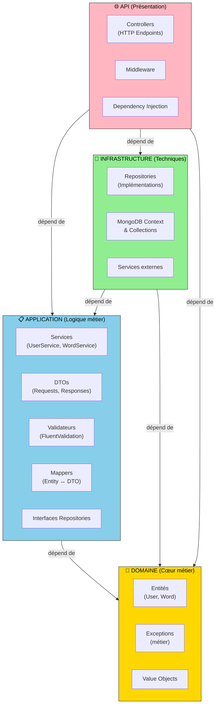
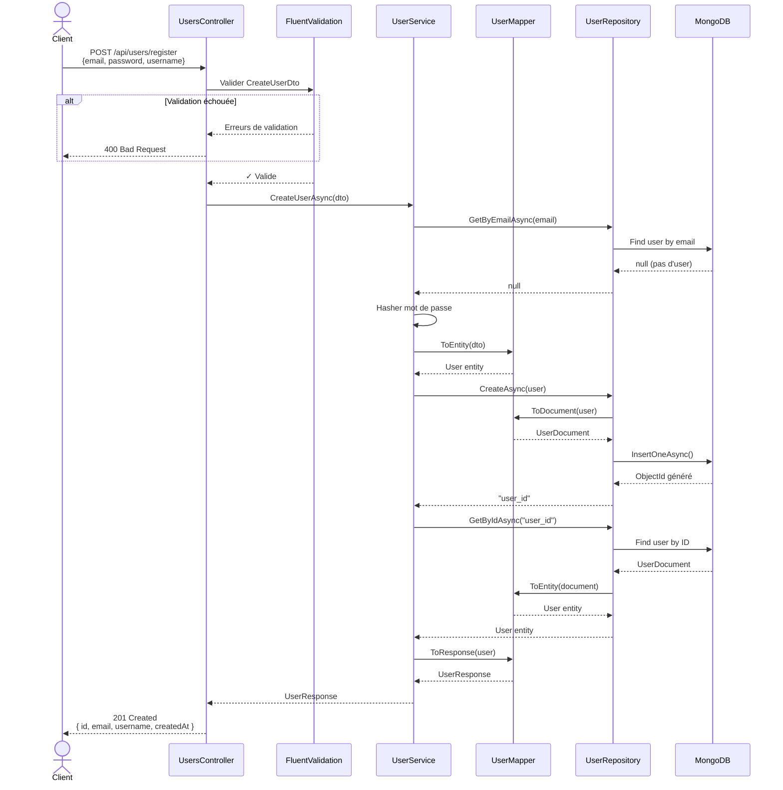
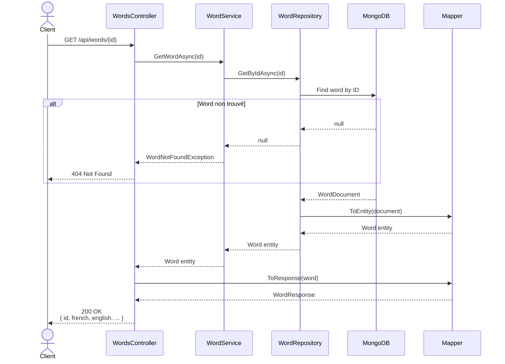

# Vue d'ensemble de la Structure Backend Polyglotte

**Date** : 2025-11-22  
**Projet** : Polyglotte - Application d'apprentissage des langues  
**Technologie** : .NET 7/8 + C# + MongoDB + Clean Architecture

---

## 📋 Table des matières

1. [Structure de répertoires](#structure-de-répertoires)
2. [Architecture générale (Clean Architecture)](#architecture-générale--clean-architecture)
3. [Mécaniques principales](#mécaniques-principales)
4. [Flux de données](#flux-de-données)
5. [Couches et responsabilités](#couches-et-responsabilités)
6. [Patterns et conventions](#patterns-et-conventions)

---

## 🗂️ Structure de répertoires

```
PolyglotteBackend/
├── PolyglotteBackend.sln              # Solution principale
│
├── Polyglotte.Domain/                 # 🎯 COUCHE DOMAINE (Entités métier)
│   ├── Entities/
│   │   ├── User.cs                    # Entité utilisateur
│   │   ├── Word.cs                    # Entité mot/vocabulaire
│   │   └── ValueObjects/              # Objets de valeur
│   ├── Exceptions/
│   │   ├── DomainException.cs         # Exception métier de base
│   │   ├── UserNotFoundException.cs
│   │   ├── WordNotFoundException.cs
│   │   └── ...
│   └── Polyglotte.Domain.csproj
│
├── Polyglotte.Application/            # 📋 COUCHE APPLICATION (Cas d'usage)
│   ├── DTOs/
│   │   ├── Requests/
│   │   │   ├── CreateUserDto.cs       # Requête création utilisateur
│   │   │   ├── UpdateUserDto.cs
│   │   │   ├── CreateWordDto.cs       # Requête création mot
│   │   │   ├── UpdateWordDto.cs
│   │   │   └── ...
│   │   ├── Responses/
│   │   │   ├── UserResponse.cs        # Réponse utilisateur
│   │   │   ├── WordResponse.cs        # Réponse mot
│   │   │   ├── AuthResponse.cs
│   │   │   └── ...
│   │   └── Validators/
│   │       ├── CreateUserDtoValidator.cs    # Validation FluentValidation
│   │       ├── CreateWordDtoValidator.cs
│   │       └── ...
│   ├── Services/
│   │   ├── IUserService.cs            # Interface service utilisateurs
│   │   ├── IWordService.cs            # Interface service mots
│   │   ├── UserService.cs             # Implémentation (logique métier)
│   │   ├── WordService.cs
│   │   └── ...
│   ├── Repositories/
│   │   ├── IUserRepository.cs         # Interface repository
│   │   ├── IWordRepository.cs
│   │   └── ...
│   ├── Mappers/
│   │   ├── UserMapper.cs              # Mapping User Entity ↔ DTO
│   │   ├── WordMapper.cs              # Mapping Word Entity ↔ DTO
│   │   └── ...
│   └── Polyglotte.Application.csproj
│
├── Polyglotte.Infrastructure/         # 🔌 COUCHE INFRASTRUCTURE (Implémentations)
│   ├── Persistence/
│   │   ├── MongoDbContext.cs          # Context MongoDB
│   │   ├── Collections/
│   │   │   ├── MongoCollectionProvider.cs   # Gestion collections
│   │   │   └── ...
│   │   └── MongoDbConfiguration.cs
│   ├── Repositories/
│   │   ├── UserRepository.cs          # Implémentation IUserRepository
│   │   ├── WordRepository.cs          # Implémentation IWordRepository
│   │   └── ...
│   ├── Documents/
│   │   ├── UserDocument.cs            # Mapping MongoDB User
│   │   ├── WordDocument.cs            # Mapping MongoDB Word
│   │   └── ...
│   ├── DependencyInjection.cs         # Enregistrement des services
│   └── Polyglotte.Infrastructure.csproj
│
├── Polyglotte.API/                    # 🌐 COUCHE PRÉSENTATION (Contrôleurs)
│   ├── Controllers/
│   │   ├── UsersController.cs         # Endpoints utilisateurs
│   │   │   ├── [HttpPost("register")]
│   │   │   ├── [HttpPost("login")]
│   │   │   ├── [HttpGet("{id}")]
│   │   │   ├── [HttpPut("{id}")]
│   │   │   ├── [HttpDelete("{id}")]
│   │   │   └── ...
│   │   ├── WordsController.cs         # Endpoints mots
│   │   │   ├── [HttpGet]
│   │   │   ├── [HttpGet("{id}")]
│   │   │   ├── [HttpPost]
│   │   │   ├── [HttpPut("{id}")]
│   │   │   ├── [HttpDelete("{id}")]
│   │   │   └── ...
│   │   └── ...
│   ├── Middleware/
│   │   ├── ExceptionHandlingMiddleware.cs   # Gestion centralisée des erreurs
│   │   ├── CorsMiddleware.cs                # Configuration CORS
│   │   └── ...
│   ├── Configuration/
│   │   ├── ServiceConfiguration.cs    # Enregistrement services DI
│   │   ├── SwaggerConfiguration.cs    # Configuration Swagger
│   │   └── ...
│   ├── Program.cs                     # Point d'entrée, wiring DI
│   ├── appsettings.json               # Configuration générale
│   ├── appsettings.Development.json
│   ├── appsettings.Production.json
│   └── Polyglotte.API.csproj
│
├── Polyglotte.Domain.Tests/           # Tests unitaires Domaine
│   ├── Entities/
│   │   └── UserTests.cs
│   └── Polyglotte.Domain.Tests.csproj
│
├── Polyglotte.Application.Tests/      # Tests unitaires Application
│   ├── Services/
│   │   ├── UserServiceTests.cs
│   │   └── WordServiceTests.cs
│   ├── Mappers/
│   │   ├── UserMapperTests.cs
│   │   └── WordMapperTests.cs
│   └── Polyglotte.Application.Tests.csproj
│
├── Polyglotte.Infrastructure.Tests/   # Tests unitaires Infrastructure
│   ├── Repositories/
│   │   ├── UserRepositoryTests.cs
│   │   └── WordRepositoryTests.cs
│   └── Polyglotte.Infrastructure.Tests.csproj
│
└── Polyglotte.API.Tests/              # Tests d'intégration API
    ├── Controllers/
    │   ├── UsersControllerTests.cs
    │   └── WordsControllerTests.cs
    └── Polyglotte.API.Tests.csproj
```

---

## 🏗️ Architecture générale (Clean Architecture)

### Principes fondamentaux

La **Clean Architecture** organise le code en couches concentriques avec **dépendances convergentes vers le centre** (le Domaine).



### Règles de dépendances

✅ **Autorisé** :

- Application → Domaine
- Infrastructure → Application + Domaine
- API → Application + Infrastructure + Domaine

❌ **Interdit** :

- Domaine → Application / Infrastructure / API
- Application → Infrastructure / API
- Infrastructure → API

---

## ⚙️ Mécaniques principales

### 1. **Injection de Dépendances (DI)**

Le conteneur .NET enregistre les services pour éviter le couplage fort.

```csharp
// Program.cs - Configuration centralisée
public static void ConfigureServices(IServiceCollection services)
{
    // Domaine (interfaces)
    services.AddScoped<IUserRepository>();
    services.AddScoped<IWordRepository>();

    // Application (services métier)
    services.AddScoped<IUserService, UserService>();
    services.AddScoped<IWordService, WordService>();

    // Infrastructure (implémentations)
    services.AddScoped<IUserRepository, UserRepository>();
    services.AddScoped<IWordRepository, WordRepository>();

    // MongoDB
    services.AddSingleton<MongoDbContext>();

    // Validation
    services.AddValidatorsFromAssemblyContaining<CreateUserDtoValidator>();

    // Configuration
    services.Configure<MongoDbSettings>(configuration.GetSection("MongoDb"));
}
```

**Avantages** :

- Facilite les tests (injection de mocks)
- Réduit le couplage
- Centralise la configuration

---

### 2. **Pattern Repository + Service**

**Repository** = Abstraction de l'accès aux données  
**Service** = Logique métier et orchestration

```csharp
// ========== REPOSITORY ==========
// Infrastructure/Repositories/UserRepository.cs

public interface IUserRepository
{
    Task<User?> GetByIdAsync(string id);
    Task<User?> GetByEmailAsync(string email);
    Task<IEnumerable<User>> GetAllAsync();
    Task<string> CreateAsync(User user);
    Task UpdateAsync(User user);
    Task DeleteAsync(string id);
}

public class UserRepository : IUserRepository
{
    private readonly IMongoCollection<UserDocument> _collection;

    public async Task<User?> GetByIdAsync(string id)
    {
        var document = await _collection.Find(u => u.Id == id).FirstOrDefaultAsync();
        return document == null ? null : UserMapper.ToEntity(document);
    }

    public async Task<string> CreateAsync(User user)
    {
        var document = UserMapper.ToDocument(user);
        await _collection.InsertOneAsync(document);
        return document.Id;
    }
}

// ========== SERVICE ==========
// Application/Services/UserService.cs

public interface IUserService
{
    Task<UserResponse> GetUserAsync(string id);
    Task<UserResponse> CreateUserAsync(CreateUserDto dto);
    Task UpdateUserAsync(string id, UpdateUserDto dto);
    Task DeleteUserAsync(string id);
}

public class UserService : IUserService
{
    private readonly IUserRepository _repository;
    private readonly IValidator<CreateUserDto> _validator;

    public async Task<UserResponse> CreateUserAsync(CreateUserDto dto)
    {
        // 1. Validation
        var validationResult = await _validator.ValidateAsync(dto);
        if (!validationResult.IsValid)
            throw new ValidationException(validationResult.Errors);

        // 2. Vérifier unicité (logique métier)
        var existingUser = await _repository.GetByEmailAsync(dto.Email);
        if (existingUser != null)
            throw new UserAlreadyExistsException();

        // 3. Créer entité
        var user = new User
        {
            Username = dto.Username,
            Email = dto.Email,
            Password = HashPassword(dto.Password),
            CreatedAt = DateTime.UtcNow
        };

        // 4. Persister
        var id = await _repository.CreateAsync(user);

        // 5. Retourner DTO réponse
        var createdUser = await _repository.GetByIdAsync(id);
        return UserMapper.ToResponse(createdUser);
    }
}
```

**Responsabilités** :

- **Repository** : CRUD pur, pas de logique métier
- **Service** : Validation, orchestration, règles métier

---

### 3. **Mapping Entity ↔ DTO**

Transformation entre les couches pour découpler les représentations.

```csharp
// Application/Mappers/UserMapper.cs

public static class UserMapper
{
    // Domain Entity → Response DTO
    public static UserResponse ToResponse(User user)
    {
        return new UserResponse
        {
            Id = user.Id,
            Username = user.Username,
            Email = user.Email,
            CreatedAt = user.CreatedAt
        };
    }

    // Request DTO → Domain Entity
    public static User ToEntity(CreateUserDto dto)
    {
        return new User
        {
            Username = dto.Username,
            Email = dto.Email,
            Password = dto.Password, // À hasher
            CreatedAt = DateTime.UtcNow
        };
    }

    // Domain Entity → MongoDB Document
    public static UserDocument ToDocument(User user)
    {
        return new UserDocument
        {
            Id = user.Id,
            Username = user.Username,
            Email = user.Email,
            Password = user.Password,
            CreatedAt = user.CreatedAt
        };
    }

    // MongoDB Document → Domain Entity
    public static User ToEntity(UserDocument document)
    {
        return new User
        {
            Id = document.Id,
            Username = document.Username,
            Email = document.Email,
            Password = document.Password,
            CreatedAt = document.CreatedAt
        };
    }
}
```

**Avantages** :

- Chaque couche a sa propre représentation
- Facilite les évolutions (changement DTO sans impact Domaine)
- Encapsulation des transformations

---

### 4. **Validation centralisée avec FluentValidation**

La validation est appliquée **avant** la logique métier.

```csharp
// Application/DTOs/Validators/CreateWordDtoValidator.cs

public class CreateWordDtoValidator : AbstractValidator<CreateWordDto>
{
    public CreateWordDtoValidator()
    {
        RuleFor(x => x.FrenchWord)
            .NotEmpty().WithMessage("Le mot français est obligatoire")
            .MaximumLength(200).WithMessage("Max 200 caractères");

        RuleFor(x => x.EnglishWord)
            .NotEmpty().WithMessage("Le mot anglais est obligatoire")
            .MaximumLength(200).WithMessage("Max 200 caractères");

        RuleFor(x => x.UserId)
            .NotEmpty().WithMessage("UserId est obligatoire");
    }
}

// ========== UTILISATION ==========
// API/Controllers/WordsController.cs

[HttpPost]
public async Task<ActionResult<WordResponse>> Create(
    [FromBody] CreateWordDto dto,
    CancellationToken cancellationToken = default)
{
    // FluentValidation validé automatiquement via ModelState
    if (!ModelState.IsValid)
        return BadRequest(ModelState);

    var result = await _wordService.CreateWordAsync(dto, cancellationToken);
    return CreatedAtAction(nameof(GetById), new { id = result.Id }, result);
}
```

---

### 5. **Gestion asynchrone avec async/await**

Toute la chaîne est asynchrone pour optimiser les performances I/O.

```csharp
// Pattern asynchrone complet

public async Task<UserResponse> GetUserAsync(string id)
{
    // Repository (appel async MongoDB)
    var user = await _userRepository.GetByIdAsync(id);

    if (user == null)
        throw new UserNotFoundException(id);

    // Mapper et retourner
    return UserMapper.ToResponse(user);
}

public async Task CreateAsync(User user)
{
    // MongoDB async
    var document = UserMapper.ToDocument(user);
    await _collection.InsertOneAsync(document);
}
```

**Bénéfices** :

- Meilleure utilisation des threads
- Scalabilité accrue
- Support du CancellationToken

---

### 6. **Gestion des erreurs avec exceptions métier**

```csharp
// Domain/Exceptions/

public class DomainException : Exception
{
    public DomainException(string message) : base(message) { }
}

public class UserNotFoundException : DomainException
{
    public UserNotFoundException(string id)
        : base($"Utilisateur '{id}' non trouvé") { }
}

public class UserAlreadyExistsException : DomainException
{
    public UserAlreadyExistsException()
        : base("Cet utilisateur existe déjà") { }
}

// ========== GESTION CENTRALISÉE ==========
// API/Middleware/ExceptionHandlingMiddleware.cs

public class ExceptionHandlingMiddleware
{
    public async Task InvokeAsync(HttpContext context, ILogger<ExceptionHandlingMiddleware> logger)
    {
        try
        {
            await _next(context);
        }
        catch (Exception ex)
        {
            logger.LogError(ex, "Exception non gérée");
            context.Response.ContentType = "application/json";

            var response = new ErrorResponse { Message = ex.Message };

            context.Response.StatusCode = ex switch
            {
                DomainException => StatusCodes.Status400BadRequest,
                ValidationException => StatusCodes.Status400BadRequest,
                UserNotFoundException => StatusCodes.Status404NotFound,
                _ => StatusCodes.Status500InternalServerError
            };

            await context.Response.WriteAsJsonAsync(response);
        }
    }
}
```

---

### 7. **MongoDB Context et Persistence**

Abstraction de MongoDB pour accès centralisé.

```csharp
// Infrastructure/Persistence/MongoDbContext.cs

public class MongoDbContext
{
    private readonly IMongoClient _client;
    private readonly IMongoDatabase _database;

    public MongoDbContext(IOptions<MongoDbSettings> options)
    {
        _client = new MongoClient(options.Value.ConnectionString);
        _database = _client.GetDatabase(options.Value.DatabaseName);
    }

    // Collections
    public IMongoCollection<UserDocument> Users
        => _database.GetCollection<UserDocument>("users");

    public IMongoCollection<WordDocument> Words
        => _database.GetCollection<WordDocument>("words");
}

// Configuration appsettings.json
{
    "MongoDb": {
        "ConnectionString": "mongodb://localhost:27017",
        "DatabaseName": "polyglotte"
    }
}
```

---

## 📊 Flux de données

### Flux complet de création d'utilisateur



### Flux de récupération d'un mot



---

## 🎯 Couches et responsabilités

### 1. **Domain (Polyglotte.Domain/)**

**Responsabilité** : Logique métier pure, indépendante de toute infrastructure

```csharp
// Domain/Entities/User.cs
public class User
{
    public string Id { get; set; } = string.Empty;
    public string Username { get; set; } = string.Empty;
    public string Email { get; set; } = string.Empty;
    public string Password { get; set; } = string.Empty;
    public DateTime CreatedAt { get; set; }

    // Logique métier domaine
    public bool VerifyPassword(string password)
    {
        return BCrypt.Net.BCrypt.Verify(password, Password);
    }
}

// Domain/Exceptions/
public class UserNotFoundException : DomainException { }
```

**Contient** :

- ✅ Entités
- ✅ Value Objects
- ✅ Exceptions métier
- ✅ Interfaces (dépôts, services)
- ❌ DTOs
- ❌ Détails techniques (MongoDB, HTTP)

---

### 2. **Application (Polyglotte.Application/)**

**Responsabilité** : Orchestration des cas d'usage, validation, mapping

```csharp
// Application/Services/UserService.cs
public class UserService : IUserService
{
    private readonly IUserRepository _repository;
    private readonly IValidator<CreateUserDto> _validator;

    public async Task<UserResponse> CreateUserAsync(CreateUserDto dto)
    {
        // 1. Validation
        var result = await _validator.ValidateAsync(dto);
        if (!result.IsValid)
            throw new ValidationException(result.Errors);

        // 2. Logique métier
        var existing = await _repository.GetByEmailAsync(dto.Email);
        if (existing != null)
            throw new UserAlreadyExistsException();

        // 3. Création
        var user = new User { ... };
        var id = await _repository.CreateAsync(user);

        // 4. Réponse
        var created = await _repository.GetByIdAsync(id);
        return UserMapper.ToResponse(created);
    }
}
```

**Contient** :

- ✅ Services métier
- ✅ DTOs (Requests, Responses)
- ✅ Validateurs
- ✅ Mappers
- ✅ Interfaces de repository
- ❌ Détails techniques (MongoDB)
- ❌ Endpoints HTTP

---

### 3. **Infrastructure (Polyglotte.Infrastructure/)**

**Responsabilité** : Implémentations techniques (BDD, APIs externes, etc.)

```csharp
// Infrastructure/Repositories/UserRepository.cs
public class UserRepository : IUserRepository
{
    private readonly IMongoCollection<UserDocument> _collection;

    public async Task<User?> GetByIdAsync(string id)
    {
        var document = await _collection
            .Find(u => u.Id == id)
            .FirstOrDefaultAsync();

        return document == null ? null : UserMapper.ToEntity(document);
    }

    public async Task<string> CreateAsync(User user)
    {
        var document = UserMapper.ToDocument(user);
        await _collection.InsertOneAsync(document);
        return document.Id;
    }
}

// Infrastructure/Documents/UserDocument.cs
public class UserDocument
{
    [BsonId]
    public string Id { get; set; } = string.Empty;

    [BsonElement("username")]
    public string Username { get; set; } = string.Empty;

    [BsonElement("email")]
    public string Email { get; set; } = string.Empty;

    [BsonElement("password")]
    public string Password { get; set; } = string.Empty;

    [BsonElement("createdAt")]
    public DateTime CreatedAt { get; set; }
}
```

**Contient** :

- ✅ Implémentations repository
- ✅ Contexte MongoDB
- ✅ Documents BSON
- ✅ Services externes
- ❌ Logique métier
- ❌ Endpoints HTTP

---

### 4. **API (Polyglotte.API/)**

**Responsabilité** : Endpoints HTTP, routage, présentation

```csharp
// API/Controllers/UsersController.cs
[ApiController]
[Route("api/[controller]")]
public class UsersController : ControllerBase
{
    private readonly IUserService _userService;

    [HttpPost("register")]
    public async Task<ActionResult<UserResponse>> Register(
        [FromBody] CreateUserDto dto,
        CancellationToken cancellationToken = default)
    {
        var result = await _userService.CreateUserAsync(dto);
        return CreatedAtAction(nameof(GetById),
            new { id = result.Id }, result);
    }

    [HttpGet("{id}")]
    public async Task<ActionResult<UserResponse>> GetById(string id)
    {
        var result = await _userService.GetUserAsync(id);
        return Ok(result);
    }
}

// API/Middleware/ExceptionHandlingMiddleware.cs
public class ExceptionHandlingMiddleware
{
    public async Task InvokeAsync(HttpContext context)
    {
        try
        {
            await _next(context);
        }
        catch (DomainException ex)
        {
            context.Response.StatusCode = StatusCodes.Status400BadRequest;
            await context.Response.WriteAsJsonAsync(new { error = ex.Message });
        }
    }
}

// API/Program.cs - Configuration complète
var builder = WebApplication.CreateBuilder(args);

// Services
builder.Services.AddScoped<IUserService, UserService>();
builder.Services.AddScoped<IUserRepository, UserRepository>();
builder.Services.AddSingleton<MongoDbContext>();
builder.Services.AddValidatorsFromAssemblyContaining<CreateUserDtoValidator>();

// Middleware
var app = builder.Build();
app.UseMiddleware<ExceptionHandlingMiddleware>();
app.MapControllers();

app.Run();
```

**Contient** :

- ✅ Controllers
- ✅ Middleware
- ✅ Configuration DI
- ✅ Swagger
- ❌ Logique métier
- ❌ Accès à la BDD

---

## 🔄 Patterns et conventions

### 1. **Pattern Repository**

Abstraction complète de l'accès aux données.

```csharp
public interface IUserRepository
{
    Task<User?> GetByIdAsync(string id);
    Task<User?> GetByEmailAsync(string email);
    Task<IEnumerable<User>> GetAllAsync();
    Task<string> CreateAsync(User user);
    Task UpdateAsync(User user);
    Task DeleteAsync(string id);
}
```

**Avantages** :

- Échange facile de MongoDB vers SQL
- Tests unitaires avec mocks
- Respect de l'abstraction

---

### 2. **Pattern Service + DTO**

Découplage entre API et logique métier.

```
Request DTOs → Service → Entity → Repository → MongoDB
                  ↓
         Response DTOs ← Mapper ← Entity
```

**Avantages** :

- Validation centralisée
- Sérialisation/Désérialisation controlée
- Évolution indépendante

---

### 3. **Validation par couches**

```
DTOs (FluentValidation)
           ↓
Service (logique métier)
           ↓
Repository (contraintes DB)
```

---

### 4. **Conventions de nommage**

| Élément              | Convention                                    | Exemple                              |
| -------------------- | --------------------------------------------- | ------------------------------------ |
| **Entité Domain**    | Singulier, PascalCase                         | `User`, `Word`                       |
| **Document MongoDB** | Singulier + "Document"                        | `UserDocument`, `WordDocument`       |
| **DTO Request**      | Avec suffixe "Dto"                            | `CreateUserDto`, `UpdateWordDto`     |
| **DTO Response**     | Singulier + "Response"                        | `UserResponse`, `WordResponse`       |
| **Service**          | Interface `I*Service`, Impl. `*Service`       | `IUserService`, `UserService`        |
| **Repository**       | Interface `I*Repository`, Impl. `*Repository` | `IUserRepository`, `UserRepository`  |
| **Mapper**           | `*Mapper` + méthodes statiques                | `UserMapper.ToEntity()`              |
| **Validator**        | `*Validator`                                  | `CreateUserDtoValidator`             |
| **Controller**       | Pluriel + "Controller"                        | `UsersController`, `WordsController` |
| **Exception**        | `*Exception`                                  | `UserNotFoundException`              |

---

### 5. **Flux HTTP standard**

```
POST   /api/users              → Créer
GET    /api/users              → Lister tous
GET    /api/users/{id}         → Récupérer un
PUT    /api/users/{id}         → Mettre à jour
DELETE /api/users/{id}         → Supprimer
```

**Codes HTTP** :

- `201 Created` : Ressource créée
- `200 OK` : Succès
- `400 Bad Request` : Validation échouée
- `404 Not Found` : Ressource non trouvée
- `500 Internal Server Error` : Erreur serveur

---

### 6. **Configuration MongoDB**

```json
{
  "MongoDb": {
    "ConnectionString": "mongodb://localhost:27017",
    "DatabaseName": "polyglotte",
    "Collections": {
      "Users": "users",
      "Words": "words"
    }
  }
}
```

---

## 🧪 Tests (Architecture)

### Structure des tests

```
Tests/
├── Domain.Tests/           # Entités, Value Objects
├── Application.Tests/      # Services, Mappers, Validators
├── Infrastructure.Tests/   # Repositories
└── API.Tests/              # Controllers, Intégration
```

### Exemple test unitaire

```csharp
[Fact]
public async Task CreateUserAsync_WithValidDto_ShouldCreateUser()
{
    // Arrange
    var dto = new CreateUserDto
    {
        Username = "john_doe",
        Email = "john@example.com",
        Password = "SecurePass123!"
    };

    var mockRepository = new Mock<IUserRepository>();
    mockRepository
        .Setup(r => r.GetByEmailAsync(It.IsAny<string>()))
        .ReturnsAsync((User?)null);

    var service = new UserService(mockRepository.Object, _validator);

    // Act
    var result = await service.CreateUserAsync(dto);

    // Assert
    Assert.NotNull(result);
    Assert.Equal(dto.Email, result.Email);
    mockRepository.Verify(r => r.CreateAsync(It.IsAny<User>()), Times.Once);
}
```

---

## 📝 Résumé

| Aspect              | Détail                                    |
| ------------------- | ----------------------------------------- |
| **Architecture**    | Clean Architecture (4 couches)            |
| **Patterns**        | Repository, Service, DTO, Mapper          |
| **BDD**             | MongoDB avec driver officiel              |
| **Framework**       | .NET 7/8 + C#                             |
| **API**             | RESTful avec ASP.NET Core                 |
| **Validation**      | FluentValidation                          |
| **DI**              | Conteneur intégré .NET                    |
| **Async**           | async/await partout                       |
| **Tests**           | xUnit + Moq (organisés par couche)        |
| **Logging**         | ILogger intégré                           |
| **Gestion erreurs** | Middleware centralisé + Exceptions métier |

---

**Dernière mise à jour** : 2025-11-22  
**Auteur** : GitHub Copilot  
**État** : Documentation complète de l'architecture backend
