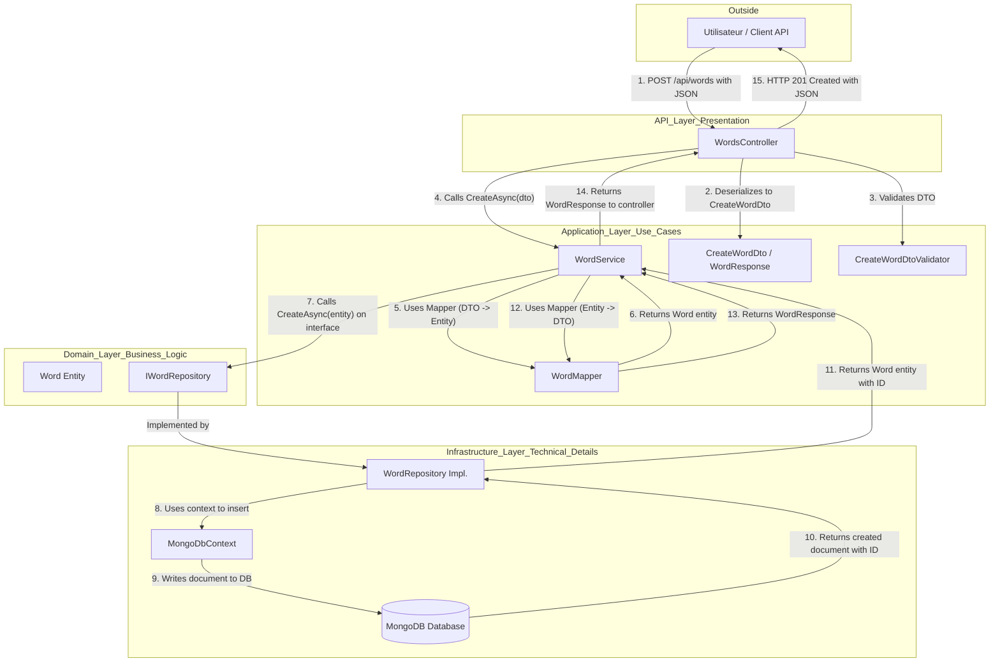

# Résumé des Interventions sur le Backend Polyglotte

Ce document résume les modifications et corrections apportées au backend du projet Polyglotte pour le mettre en conformité avec les principes de la Clean Architecture, corriger les erreurs de compilation et mettre en place un système de mapping manuel.

## 1. Correction de l'Architecture et des Dépendances

L'objectif était d'aligner la structure du projet sur la **Clean Architecture**, où les dépendances convergent vers le centre (le Domaine).

- **Mise à jour des références de projet (`.csproj`)** :
  - `Polyglotte.API` dépend de `Application` et `Infrastructure`.
  - `Polyglotte.Infrastructure` dépend de `Application`.
  - `Polyglotte.Application` dépend de `Domain`.
  - `Polyglotte.Domain` ne dépend d'aucun autre projet.

- **Gestion des paquets NuGet** :
  - Ajout de `FluentValidation.AspNetCore` et `FluentValidation.DependencyInjectionExtensions` pour la validation des DTOs.
  - Mise à jour du driver `MongoDB.Driver` pour une meilleure compatibilité et de nouvelles fonctionnalités.

- **Correction des `using` manquants** :
  - Ajout de `using FluentValidation;` dans `CreateWordDtoValidator.cs`.
  - Ajout de `using FluentValidation.Results;` dans `WordsController.cs` pour résoudre le type `ValidationResult`.

## 2. Implémentation du Mapping Manuel

Pour garder un contrôle total sur la conversion des objets et éviter la "magie" des bibliothèques tierces, un système de mapping manuel a été mis en place.

- **Abandon d'AutoMapper** : La bibliothèque AutoMapper a été retirée du projet.
- **Création de `WordMapper.cs`** : Une classe statique `WordMapper` a été créée dans `Polyglotte.Application/Mappings`. Elle centralise toute la logique de conversion entre les DTOs (`CreateWordDto`, `UpdateWordDto`, `WordResponse`) et l'entité `Word`.
- **Mise à jour de `WordService.cs`** : Le service a été refactorisé pour utiliser `WordMapper` pour toutes les opérations de mapping. Cela rend le code plus propre, plus lisible et centralise la logique de conversion.

## 3. Correction du Repository

- **`WordRepository.cs`** : La méthode `CreateAsync` a été corrigée pour gérer correctement la création de l'ID par MongoDB. Elle retourne maintenant une nouvelle instance de l'entité avec l'ID généré, ce qui évite les effets de bord sur l'objet original.

## 4. Schéma de Flux de Données

Le schéma ci-dessous illustre le flux d'une requête pour créer un nouveau mot, en traversant les différentes couches de l'application.

