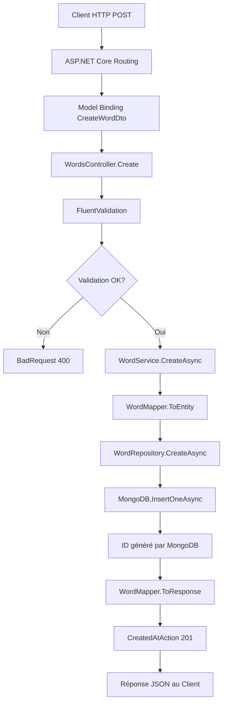

# Analyse détaillée de la méthode Create du WordsController

**Dernière mise à jour :** 2025-11-01  
**Fichier analysé :** `PolyglotteBackend\Polyglotte.API\Controllers\WordsController.cs`  
**Méthode :** `Create([FromBody] CreateWordDto dto, CancellationToken cancellationToken)`

## Vue d'ensemble

Ce document analyse étape par étape le processus complet de la méthode `Create` du `WordsController`, depuis la réception de la requête HTTP jusqu'à la réponse renvoyée au client. Cette méthode implémente l'architecture Clean Architecture et utilise FluentValidation pour la validation des données.

## Signature de la méthode

```csharp
[HttpPost]
public async Task<IActionResult> Create([FromBody] CreateWordDto dto, CancellationToken cancellationToken)
```

### Attributs et paramètres
- **`[HttpPost]`** : Indique que cette méthode répond aux requêtes HTTP POST
- **`async Task<IActionResult>`** : Méthode asynchrone qui retourne une réponse HTTP
- **`[FromBody] CreateWordDto dto`** : Désérialise automatiquement le JSON de la requête vers l'objet DTO
- **`CancellationToken cancellationToken`** : Permet l'annulation de l'opération si nécessaire

## Analyse étape par étape du processus

### Étape 1 : Réception de la requête HTTP

```http
POST /api/words
Content-Type: application/json

{
  "englishWord": "Hello",
  "frenchWord": "Bonjour"
}
```

**Ce qui se passe :**
- ASP.NET Core reçoit la requête HTTP POST sur l'endpoint `/api/words`
- Le routage identifie la méthode `Create` du `WordsController`
- Le model binder désérialise automatiquement le JSON en objet `CreateWordDto`
- Le `CancellationToken` est injecté par le framework

**Structure du DTO :**
```csharp
public class CreateWordDto
{
    public string EnglishWord { get; set; } = string.Empty;
    public string FrenchWord { get; set; } = string.Empty;
}
```

### Étape 2 : Validation avec FluentValidation

```csharp
ValidationResult validation = await _createValidator.ValidateAsync(dto, cancellationToken);
if (!validation.IsValid) return BadRequest(validation.ToDictionary());
```

**Ce qui se passe :**

1. **Appel du validateur :**
   - Le `_createValidator` (injecté via DI) est de type `IValidator<CreateWordDto>`
   - Il s'agit concrètement de `CreateWordDtoValidator`

2. **Règles de validation appliquées :**
   ```csharp
   public class CreateWordDtoValidator : AbstractValidator<CreateWordDto>
   {
       public CreateWordDtoValidator()
       {
           RuleFor(x => x.EnglishWord)
               .NotEmpty()
               .MaximumLength(200);

           RuleFor(x => x.FrenchWord)
               .NotEmpty()
               .MaximumLength(200);
       }
   }
   ```

3. **Vérifications effectuées :**
   - `EnglishWord` ne doit pas être vide ou null
   - `EnglishWord` ne doit pas dépasser 200 caractères
   - `FrenchWord` ne doit pas être vide ou null
   - `FrenchWord` ne doit pas dépasser 200 caractères

4. **Si la validation échoue :**
   - Retour immédiat d'une réponse `BadRequest (400)`
   - Le `ValidationResult` est converti en dictionnaire d'erreurs
   - Format de réponse d'erreur :
   ```json
   {
     "EnglishWord": ["'English Word' must not be empty."],
     "FrenchWord": ["'French Word' must not be empty."]
   }
   ```

### Étape 3 : Appel du service métier

```csharp
var created = await _service.CreateAsync(dto, cancellationToken);
```

**Ce qui se passe :**

1. **Injection de dépendance :**
   - `_service` est de type `IWordService`
   - Implémentation concrète : `WordService`

2. **Traitement dans WordService.CreateAsync :**
   ```csharp
   public async Task<WordResponse> CreateAsync(CreateWordDto dto, CancellationToken cancellationToken = default)
   {
       var word = WordMapper.ToEntity(dto);
       var created = await _repository.CreateAsync(word, cancellationToken);
       return WordMapper.ToResponse(created);
   }
   ```

### Étape 4 : Mapping DTO vers Entité Domain

```csharp
var word = WordMapper.ToEntity(dto);
```

**Ce qui se passe :**
```csharp
public static Word ToEntity(CreateWordDto dto)
{
    return new Word
    {
        EnglishWord = dto.EnglishWord,
        FrenchWord = dto.FrenchWord,
        CreatedAt = DateTime.UtcNow
    };
}
```

**Transformation :**
- `CreateWordDto` → `Word` (entité Domain)
- Ajout automatique de `CreatedAt` avec l'heure UTC actuelle
- L'`Id` reste vide (sera généré par MongoDB)

### Étape 5 : Persistance via Repository

```csharp
var created = await _repository.CreateAsync(word, cancellationToken);
```

**Ce qui se passe dans WordRepository.CreateAsync :**

1. **Conversion vers Document MongoDB :**
   ```csharp
   private static WordDocument ToDocument(Word w)
   {
       var doc = new WordDocument
       {
           EnglishWord = w.EnglishWord,
           FrenchWord = w.FrenchWord,
           CreatedAt = w.CreatedAt
       };

       if (!string.IsNullOrEmpty(w.Id))
       {
           doc.Id = w.Id;
       }

       return doc;
   }
   ```

2. **Insertion en base MongoDB :**
   ```csharp
   await _context.Words.InsertOneAsync(doc, cancellationToken: cancellationToken);
   ```

3. **Retour de l'entité avec ID généré :**
   ```csharp
   return ToDomain(doc); // Retourne Word avec l'ID MongoDB généré
   ```

### Étape 6 : Mapping Entité vers DTO de réponse

```csharp
return WordMapper.ToResponse(created);
```

**Ce qui se passe :**
```csharp
public static WordResponse ToResponse(Word entity)
{
    return new WordResponse
    {
        Id = entity.Id,
        EnglishWord = entity.EnglishWord,
        FrenchWord = entity.FrenchWord,
        CreatedAt = entity.CreatedAt
    };
}
```

**Transformation :**
- `Word` (entité avec ID généré) → `WordResponse`
- Tous les champs sont mappés, y compris l'ID MongoDB généré

### Étape 7 : Génération de la réponse HTTP

```csharp
return CreatedAtAction(nameof(GetById), new { id = created.Id }, created);
```

**Ce qui se passe :**

1. **Type de réponse :** `HTTP 201 Created`
2. **Header Location :** Automatiquement généré vers `GET /api/words/{id}`
3. **Corps de la réponse :** L'objet `WordResponse` sérialisé en JSON

**Exemple de réponse complète :**
```http
HTTP/1.1 201 Created
Location: https://localhost:7081/api/words/672f8a1b2c3d4e5f67890123
Content-Type: application/json

{
  "id": "672f8a1b2c3d4e5f67890123",
  "englishWord": "Hello",
  "frenchWord": "Bonjour",
  "createdAt": "2025-11-01T14:30:25.123Z"
}
```

## Flux de données complet



## Gestion des erreurs

### Erreurs de validation (400 Bad Request)
```json
{
  "EnglishWord": ["'English Word' must not be empty."],
  "FrenchWord": ["The length of 'French Word' must be 200 characters or fewer."]
}
```

### Erreurs internes potentielles (500 Internal Server Error)
- Problème de connexion MongoDB
- Erreur de sérialisation/désérialisation
- Exception dans le mapping
- Problème d'injection de dépendance

## Points d'architecture remarquables

### 1. Séparation des responsabilités (Clean Architecture)
- **Controller** : Gestion HTTP, validation, orchestration
- **Service** : Logique métier et orchestration des use cases
- **Repository** : Accès aux données et persistance
- **Mapper** : Transformation entre les couches

### 2. Inversion de dépendance
```csharp
public WordsController(
    IWordService service,                    // Interface Application
    IValidator<CreateWordDto> createValidator // Interface FluentValidation
)
```

### 3. Gestion asynchrone
- Toute la chaîne est asynchrone (`async`/`await`)
- Support du `CancellationToken` pour l'annulation
- Performance optimisée pour les I/O

### 4. Validation centralisée
- Règles de validation séparées du contrôleur
- Réutilisables et testables indépendamment
- Messages d'erreur cohérents et localisables

## Optimisations et bonnes pratiques

### ✅ Points forts de l'implémentation actuelle
- Architecture Clean respectée
- Validation robuste avec FluentValidation
- Gestion asynchrone complète
- Séparation des préoccupations
- Mapping manuel (contrôle total)
- Réponse HTTP standard (201 Created avec Location)

### 💡 Améliorations possibles
1. **Logging :** Ajouter des logs pour le debugging
2. **Métriques :** Instrumenter pour le monitoring
3. **Cache :** Potentiel cache sur les validations répétées
4. **Pagination :** Préparer pour de gros volumes
5. **Versioning :** Support des versions d'API futures

## Tests recommandés

### Tests unitaires pour WordsController.Create
```csharp
[Fact]
public async Task Create_WithValidDto_ShouldReturn201Created()
{
    // Arrange
    var dto = new CreateWordDto { EnglishWord = "Test", FrenchWord = "Essai" };
    var expectedResponse = new WordResponse { Id = "123", EnglishWord = "Test", FrenchWord = "Essai" };
    
    _mockValidator.Setup(x => x.ValidateAsync(dto, It.IsAny<CancellationToken>()))
               .ReturnsAsync(new ValidationResult());
    _mockService.Setup(x => x.CreateAsync(dto, It.IsAny<CancellationToken>()))
              .ReturnsAsync(expectedResponse);

    // Act
    var result = await _controller.Create(dto, CancellationToken.None);

    // Assert
    var createdResult = Assert.IsType<CreatedAtActionResult>(result);
    Assert.Equal(expectedResponse, createdResult.Value);
}

[Fact]
public async Task Create_WithInvalidDto_ShouldReturn400BadRequest()
{
    // Arrange
    var dto = new CreateWordDto { EnglishWord = "", FrenchWord = "Essai" };
    var validationResult = new ValidationResult(new[]
    {
        new ValidationFailure("EnglishWord", "Must not be empty")
    });
    
    _mockValidator.Setup(x => x.ValidateAsync(dto, It.IsAny<CancellationToken>()))
               .ReturnsAsync(validationResult);

    // Act
    var result = await _controller.Create(dto, CancellationToken.None);

    // Assert
    var badRequestResult = Assert.IsType<BadRequestObjectResult>(result);
    Assert.NotNull(badRequestResult.Value);
}
```

## Conclusion

La méthode `Create` du `WordsController` implémente un pattern robuste et conforme aux bonnes pratiques :

- **Validation explicite** avec FluentValidation
- **Architecture Clean** avec séparation des couches
- **Gestion d'erreurs appropriée** avec codes de statut HTTP
- **Mapping contrôlé** entre les différentes représentations
- **Persistance asynchrone** avec MongoDB
- **Réponse standard** HTTP 201 Created

Cette implémentation est prête pour la production et facilement extensible pour de nouvelles fonctionnalités.

**Confiance estimée : 99%**

Le processus est entièrement documenté avec tous les détails techniques et architecturaux nécessaires à la compréhension et maintenance du code.