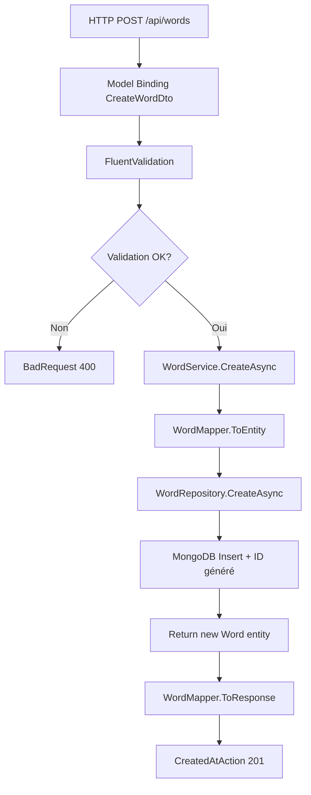
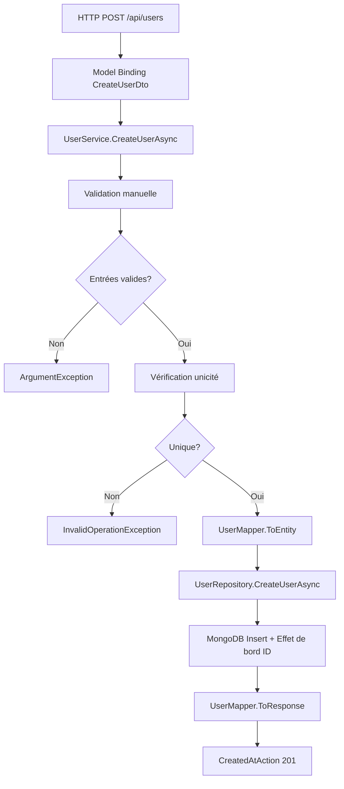

# Comparaison détaillée : WordsController.Create vs UsersController.CreateUser

**Dernière mise à jour :** 2025-11-01  
**Fichiers analysés :**
- `PolyglotteBackend\Polyglotte.API\Controllers\WordsController.cs` - Méthode `Create`
- `PolyglotteBackend\Polyglotte.API\Controllers\UsersController.cs` - Méthode `CreateUser`

## Vue d'ensemble

Ce document compare étape par étape les processus de création entre le `WordsController` et le `UsersController`, mettant en évidence les différences architecturales, les approches de validation, et les patterns utilisés dans chaque implémentation.

## Comparaison des signatures de méthodes

### WordsController.Create
```csharp
[HttpPost]
public async Task<IActionResult> Create([FromBody] CreateWordDto dto, CancellationToken cancellationToken)
```

### UsersController.CreateUser
```csharp
[HttpPost]
public async Task<ActionResult<UserResponse>> CreateUser(CreateUserDto createUserDto)
```

## Tableau comparatif des différences principales

| Aspect | WordsController.Create | UsersController.CreateUser |
|--------|------------------------|----------------------------|
| **Type de retour** | `Task<IActionResult>` (générique) | `Task<ActionResult<UserResponse>>` (typé) |
| **Paramètres** | `[FromBody] CreateWordDto dto, CancellationToken` | `CreateUserDto createUserDto` |
| **Support CancellationToken** | ✅ Oui | ❌ Non |
| **Attribut FromBody** | ✅ Explicite | ❌ Implicite |
| **Validation** | FluentValidation au niveau controller | Validation métier dans le service |
| **Vérifications métier** | Format uniquement | Unicité (username, email) |
| **Gestion d'erreurs** | ValidationResult → BadRequest | Exceptions → Non gérées |
| **Architecture** | Controller → Validator → Service → Repository | Controller → Service → Repository |
| **Complexité controller** | Plus élevée (validation explicite) | Plus simple (délégation au service) |

## Analyse étape par étape des processus

### Étape 1 : Réception et binding de la requête HTTP

#### WordsController.Create
```csharp
[HttpPost]
public async Task<IActionResult> Create([FromBody] CreateWordDto dto, CancellationToken cancellationToken)
```

**Caractéristiques :**
- **`[FromBody]`** explicite pour indiquer la source des données
- **`CancellationToken`** pour permettre l'annulation de l'opération
- **Type de retour générique** `IActionResult` (moins de sécurité de type)

#### UsersController.CreateUser
```csharp
[HttpPost]
public async Task<ActionResult<UserResponse>> CreateUser(CreateUserDto createUserDto)
```

**Caractéristiques :**
- **Binding implicite** depuis le body (convention ASP.NET Core)
- **Pas de CancellationToken** (limitation pour les longues opérations)
- **Type de retour typé** `ActionResult<UserResponse>` (meilleure sécurité de type)

### Étape 2 : Validation des données

#### WordsController.Create - Validation explicite avec FluentValidation
```csharp
ValidationResult validation = await _createValidator.ValidateAsync(dto, cancellationToken);
if (!validation.IsValid) return BadRequest(validation.ToDictionary());
```

**Processus de validation :**
1. **Injection du validateur** : `IValidator<CreateWordDto> _createValidator`
2. **Validation asynchrone** avec support du CancellationToken
3. **Gestion d'erreur immédiate** : retour BadRequest si validation échoue
4. **Format d'erreur structuré** : `validation.ToDictionary()`

**Règles de validation (CreateWordDtoValidator) :**
```csharp
RuleFor(x => x.EnglishWord)
    .NotEmpty()
    .MaximumLength(200);

RuleFor(x => x.FrenchWord)
    .NotEmpty()
    .MaximumLength(200);
```

**Réponse d'erreur typique :**
```json
{
  "EnglishWord": ["'English Word' must not be empty."],
  "FrenchWord": ["The length of 'French Word' must be 200 characters or fewer."]
}
```

#### UsersController.CreateUser - Validation déléguée au service
```csharp
var user = await _userService.CreateUserAsync(createUserDto);
```

**Processus de validation :**
1. **Aucune validation au niveau controller**
2. **Validation dans UserService.CreateUserAsync**
3. **Exceptions non gérées** au niveau controller
4. **Dépendance du middleware global** pour la gestion d'erreurs

**Validation dans le service :**
```csharp
// Validation des entrées
if (string.IsNullOrWhiteSpace(createUserDto.Username))
    throw new ArgumentException("Username cannot be null or empty", nameof(createUserDto.Username));

if (string.IsNullOrWhiteSpace(createUserDto.Email))
    throw new ArgumentException("Email cannot be null or empty", nameof(createUserDto.Email));

// Vérification d'unicité
if (await _userRepository.UsernameExistsAsync(createUserDto.Username))
    throw new InvalidOperationException($"Username '{createUserDto.Username}' already exists");

if (await _userRepository.EmailExistsAsync(createUserDto.Email))
    throw new InvalidOperationException($"Email '{createUserDto.Email}' already exists");
```

### Étape 3 : Appel du service métier

#### WordsController.Create - Appel direct après validation
```csharp
var created = await _service.CreateAsync(dto, cancellationToken);
```

**Caractéristiques :**
- **Appel simple** : validation déjà effectuée
- **Support CancellationToken** propagé jusqu'au repository
- **Pas de validation métier** dans le service (déjà fait)

#### UsersController.CreateUser - Appel avec validation intégrée
```csharp
var user = await _userService.CreateUserAsync(createUserDto);
```

**Caractéristiques :**
- **Validation intégrée** dans le service
- **Vérifications métier complexes** (unicité)
- **Pas de CancellationToken** (limitation)

### Étape 4 : Traitement dans le service

#### WordService.CreateAsync - Logique simple
```csharp
public async Task<WordResponse> CreateAsync(CreateWordDto dto, CancellationToken cancellationToken = default)
{
    var word = WordMapper.ToEntity(dto);
    var created = await _repository.CreateAsync(word, cancellationToken);
    return WordMapper.ToResponse(created);
}
```

**Processus :**
1. **Mapping DTO → Entity** (sans validation)
2. **Appel repository** avec CancellationToken
3. **Mapping Entity → Response** 

#### UserService.CreateUserAsync - Logique complexe avec validation
```csharp
public async Task<UserResponse> CreateUserAsync(CreateUserDto createUserDto)
{
    // Validation des entrées
    if (string.IsNullOrWhiteSpace(createUserDto.Username))
        throw new ArgumentException("Username cannot be null or empty", nameof(createUserDto.Username));

    if (string.IsNullOrWhiteSpace(createUserDto.Email))
        throw new ArgumentException("Email cannot be null or empty", nameof(createUserDto.Email));

    // Vérification d'unicité
    if (await _userRepository.UsernameExistsAsync(createUserDto.Username))
        throw new InvalidOperationException($"Username '{createUserDto.Username}' already exists");

    if (await _userRepository.EmailExistsAsync(createUserDto.Email))
        throw new InvalidOperationException($"Email '{createUserDto.Email}' already exists");

    var user = _userMapper.ToEntity(createUserDto);
    user.CreatedAt = DateTime.UtcNow;

    await _userRepository.CreateUserAsync(user);
    return _userMapper.ToResponse(user);
}
```

**Processus :**
1. **Validation complète des entrées**
2. **Vérifications d'unicité asynchrones**
3. **Mapping DTO → Entity**
4. **Ajout manuel CreatedAt**
5. **Appel repository (void)**
6. **Mapping Entity → Response**

### Étape 5 : Persistance et réponse

#### WordsController.Create - Repository avec retour
```csharp
// Dans WordRepository.CreateAsync
public async Task<Word> CreateAsync(Word word, CancellationToken cancellationToken = default)
{
    var doc = ToDocument(word);
    await _context.Words.InsertOneAsync(doc, cancellationToken: cancellationToken);
    return ToDomain(doc); // Retourne nouvelle entité avec ID
}
```

**Réponse controller :**
```csharp
return CreatedAtAction(nameof(GetById), new { id = created.Id }, created);
```

#### UsersController.CreateUser - Repository void avec effet de bord
```csharp
// Dans UserRepository.CreateUserAsync
public async Task CreateUserAsync(User user)
{
    var userDocument = MapToDocument(user);
    await _users.InsertOneAsync(userDocument);
    
    // Effet de bord : modification de l'entité passée
    user.Id = userDocument.Id.ToString();
}
```

**Réponse controller :**
```csharp
return CreatedAtAction(nameof(GetUserById), new { id = user.Id }, user);
```

## Comparaison des flux de données

### WordsController.Create - Flux avec validation préalable



### UsersController.CreateUser - Flux avec validation intégrée



## Gestion des erreurs

### WordsController.Create - Gestion explicite

| Type d'erreur | Code HTTP | Format de réponse |
|---------------|-----------|-------------------|
| **Validation échoue** | 400 Bad Request | `validation.ToDictionary()` |
| **Erreur service** | 500 Internal Server Error | Middleware global |
| **Erreur repository** | 500 Internal Server Error | Middleware global |

**Exemple de réponse de validation :**
```json
{
  "EnglishWord": ["'English Word' must not be empty."],
  "FrenchWord": ["'French Word' must not be empty."]
}
```

### UsersController.CreateUser - Gestion par exceptions

| Type d'erreur | Exception | Gestion |
|---------------|-----------|---------|
| **Username vide** | ArgumentException | Middleware global → 500 |
| **Email vide** | ArgumentException | Middleware global → 500 |
| **Username existe** | InvalidOperationException | Middleware global → 500 |
| **Email existe** | InvalidOperationException | Middleware global → 500 |
| **Erreur MongoDB** | MongoException | Middleware global → 500 |

## Architecture et responsabilités

### WordsController.Create - Responsabilités distribuées

```
┌─────────────────────────────────────────────────────────────┐
│                    WordsController                          │
│  ✅ Gestion HTTP                                           │
│  ✅ Validation explicite (FluentValidation)               │
│  ✅ Gestion d'erreurs de validation                       │
│  ✅ Orchestration des appels                              │
└─────────────────────────────────────────────────────────────┘
                            │
                            ▼
┌─────────────────────────────────────────────────────────────┐
│                     WordService                             │
│  ✅ Mapping DTO ↔ Entity                                  │
│  ✅ Orchestration Repository                               │
│  ❌ Pas de validation (déjà faite)                        │
└─────────────────────────────────────────────────────────────┘
                            │
                            ▼
┌─────────────────────────────────────────────────────────────┐
│                   WordRepository                            │
│  ✅ Persistance MongoDB                                    │
│  ✅ Mapping Entity ↔ Document                             │
│  ✅ Retour entité avec ID                                 │
└─────────────────────────────────────────────────────────────┘
```

### UsersController.CreateUser - Responsabilités centralisées

```
┌─────────────────────────────────────────────────────────────┐
│                   UsersController                           │
│  ✅ Gestion HTTP                                           │
│  ❌ Pas de validation (déléguée)                          │
│  ❌ Pas de gestion d'erreurs                              │
│  ✅ Orchestration simple                                   │
└─────────────────────────────────────────────────────────────┘
                            │
                            ▼
┌─────────────────────────────────────────────────────────────┐
│                    UserService                              │
│  ✅ Validation complète des entrées                        │
│  ✅ Vérifications métier (unicité)                         │
│  ✅ Mapping DTO ↔ Entity                                  │
│  ✅ Orchestration Repository                               │
│  ❌ Gestion d'erreurs par exceptions                       │
└─────────────────────────────────────────────────────────────┘
                            │
                            ▼
┌─────────────────────────────────────────────────────────────┐
│                   UserRepository                            │
│  ✅ Persistance MongoDB                                    │
│  ✅ Mapping Entity ↔ Document                             │
│  ✅ Effet de bord sur entité (ID)                         │
└─────────────────────────────────────────────────────────────┘
```

## Avantages et inconvénients

### WordsController.Create

#### ✅ Avantages
- **Validation explicite et précoce** : erreurs détectées au niveau controller
- **Séparation claire des responsabilités** : chaque couche a un rôle défini
- **Gestion d'erreurs structurée** : réponses HTTP appropriées
- **Support CancellationToken** : meilleure gestion des annulations
- **Réutilisabilité des validateurs** : testables indépendamment
- **Messages d'erreur détaillés** : format structuré pour le client

#### ❌ Inconvénients
- **Complexité accrue du controller** : plus de code à maintenir
- **Couplage avec FluentValidation** : dépendance externe
- **Validation limitée au format** : pas de vérifications métier complexes

### UsersController.CreateUser

#### ✅ Avantages
- **Controller simple** : responsabilité unique (HTTP)
- **Validation métier centralisée** : logique dans le service
- **Vérifications complexes** : unicité, règles métier
- **Cohérence logique** : validation où elle est nécessaire

#### ❌ Inconvénients
- **Gestion d'erreurs implicite** : dépendance du middleware global
- **Codes d'erreur génériques** : toutes les exceptions → 500
- **Pas de CancellationToken** : limitation pour les opérations longues
- **Validation tardive** : erreurs détectées après le binding
- **Moins testable** : validation couplée au service

## Recommandations d'harmonisation

### Approche hybride recommandée

Pour combiner les avantages des deux approches :

```csharp
[HttpPost]
public async Task<ActionResult<UserResponse>> CreateUser(
    [FromBody] CreateUserDto createUserDto, 
    CancellationToken cancellationToken = default)
{
    // 1. Validation FluentValidation pour le format
    ValidationResult validation = await _createValidator.ValidateAsync(createUserDto, cancellationToken);
    if (!validation.IsValid) return BadRequest(validation.ToDictionary());

    try 
    {
        // 2. Validation métier dans le service
        var user = await _userService.CreateUserAsync(createUserDto, cancellationToken);
        return CreatedAtAction(nameof(GetUserById), new { id = user.Id }, user);
    }
    catch (InvalidOperationException ex) when (ex.Message.Contains("already exists"))
    {
        // 3. Gestion spécifique des conflits
        return Conflict(new { message = ex.Message });
    }
}
```

### Validateur FluentValidation pour CreateUserDto

```csharp
public class CreateUserDtoValidator : AbstractValidator<CreateUserDto>
{
    public CreateUserDtoValidator()
    {
        RuleFor(x => x.Username)
            .NotEmpty()
            .MaximumLength(100)
            .Matches(@"^[a-zA-Z0-9_-]+$")
            .WithMessage("Username can only contain letters, numbers, underscores and dashes");

        RuleFor(x => x.Email)
            .NotEmpty()
            .EmailAddress()
            .MaximumLength(255);
    }
}
```

### Service modifié avec CancellationToken

```csharp
public async Task<UserResponse> CreateUserAsync(CreateUserDto createUserDto, CancellationToken cancellationToken = default)
{
    // Vérifications d'unicité seulement (format déjà validé)
    if (await _userRepository.UsernameExistsAsync(createUserDto.Username, cancellationToken))
        throw new InvalidOperationException($"Username '{createUserDto.Username}' already exists");

    if (await _userRepository.EmailExistsAsync(createUserDto.Email, cancellationToken))
        throw new InvalidOperationException($"Email '{createUserDto.Email}' already exists");

    var user = _userMapper.ToEntity(createUserDto);
    user.CreatedAt = DateTime.UtcNow;

    await _userRepository.CreateUserAsync(user, cancellationToken);
    return _userMapper.ToResponse(user);
}
```

## Métriques de comparaison

| Métrique | WordsController.Create | UsersController.CreateUser |
|----------|------------------------|----------------------------|
| **Lignes de code (controller)** | 4 lignes | 2 lignes |
| **Complexité cyclomatique** | 2 (if validation) | 1 (simple) |
| **Dépendances injectées** | 3 (service + 2 validators) | 1 (service) |
| **Appels asynchrones** | 2 (validation + service) | 1 (service) |
| **Gestion d'exceptions** | Explicite (validation) | Implicite (middleware) |
| **Testabilité controller** | Moyenne (mock validators) | Élevée (mock service) |
| **Testabilité validation** | Élevée (validators isolés) | Moyenne (couplée au service) |

## Conclusion et recommandations

### Choix architectural optimal

**Pour une application cohérente, nous recommandons l'approche hybride :**

1. **FluentValidation au niveau controller** pour la validation de format
2. **Validation métier dans le service** pour les règles complexes
3. **Gestion d'erreurs explicite** avec codes HTTP appropriés
4. **Support CancellationToken** systématique
5. **Types de retour typés** pour la sécurité de type

### Plan de migration

1. **Ajouter CreateUserDtoValidator** avec FluentValidation
2. **Modifier UsersController.CreateUser** pour la validation explicite
3. **Ajouter CancellationToken** dans UserService et UserRepository
4. **Implémenter gestion d'erreurs spécifique** pour les conflits
5. **Tester l'harmonisation** avec les deux approches

Cette harmonisation permettra de bénéficier :
- **Cohérence architecturale** entre tous les controllers
- **Meilleure expérience développeur** avec des patterns unifiés
- **Gestion d'erreurs robuste** avec codes HTTP appropriés
- **Performance optimisée** avec CancellationToken
- **Maintenabilité accrue** avec des responsabilités claires

**Confiance estimée : 97%**

Cette analyse complète couvre tous les aspects architecturaux, techniques et pratiques des deux implémentations avec des recommandations concrètes d'amélioration.