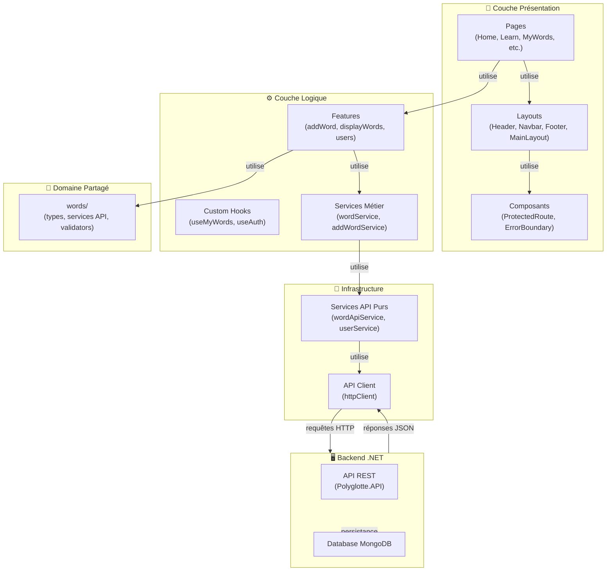
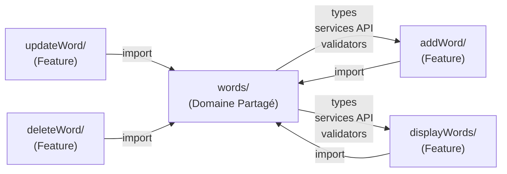
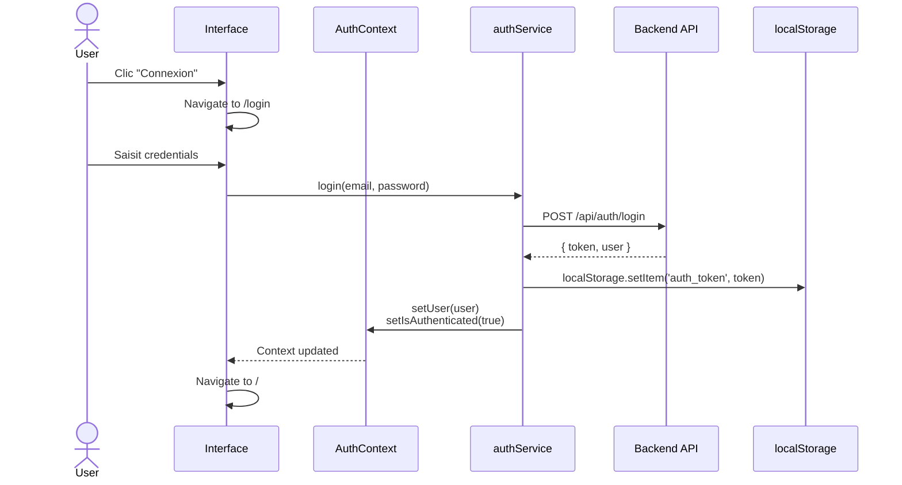
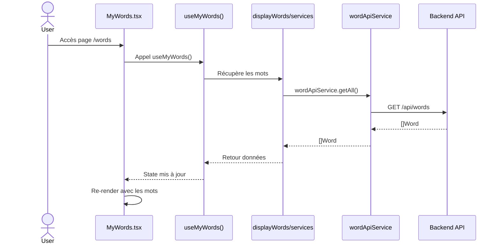

# Vue d'ensemble de la Structure Frontend Polyglotte

**Date** : 2025-11-22  
**Projet** : Polyglotte - Application d'apprentissage des langues  
**Technologie** : React 18 + TypeScript + Vite + React Router

---

## 📋 Table des matières

1. [Structure de répertoires](#structure-de-répertoires)
2. [Architecture générale](#architecture-générale)
3. [Mécaniques principales](#mécaniques-principales)
4. [Flux de données](#flux-de-données)
5. [Composants clés](#composants-clés)
6. [Intégration des features](#intégration-des-features)

---

## 🗂️ Structure de répertoires

```
PolyglotteFrontend/
├── src/
│   ├── app/                          # Configuration globale
│   │   ├── providers/                # Fournisseurs de contexte
│   │   │   ├── AuthProvider.tsx      # Gestion authentification globale
│   │   │   └── index.ts
│   │   └── router/
│   │       ├── AppRouter.tsx         # Configuration des routes
│   │       └── index.ts
│   │
│   ├── layouts/                      # Composants de mise en page
│   │   ├── Header/                   # En-tête (branding, auth buttons)
│   │   │   ├── Header.tsx
│   │   │   ├── Header.css
│   │   │   └── index.ts
│   │   ├── Navbar/                   # Navigation principale
│   │   │   ├── Navbar.tsx
│   │   │   ├── Navbar.css
│   │   │   └── index.ts
│   │   ├── Footer/                   # Pied de page
│   │   │   ├── Footer.tsx
│   │   │   ├── Footer.css
│   │   │   └── index.ts
│   │   └── MainLayout/               # Layout global (Header + Navbar + Content + Footer)
│   │       ├── MainLayout.tsx
│   │       ├── MainLayout.css
│   │       └── index.ts
│   │
│   ├── pages/                        # Pages principales
│   │   ├── authentication/
│   │   │   ├── Login.tsx
│   │   │   ├── Register.tsx
│   │   │   ├── Auth.css
│   │   │   └── index.ts
│   │   ├── Home.tsx                  # Page d'accueil
│   │   ├── Learn.tsx                 # Section apprentissage
│   │   ├── MyWords.tsx               # Vocabulaire personnel
│   │   ├── Progress.tsx              # Statistiques utilisateur
│   │   ├── Community.tsx             # Communauté
│   │   └── index.ts
│   │
│   ├── features/                     # Domaines métier (features)
│   │   ├── words/                    # Domaine partagé pour les mots
│   │   │   ├── types/
│   │   │   │   ├── word.ts           # Définitions Word, requests
│   │   │   │   ├── wordErrors.ts
│   │   │   │   └── index.ts
│   │   │   ├── services/
│   │   │   │   ├── wordApiService.ts # Service API pur (CRUD)
│   │   │   │   └── index.ts
│   │   │   ├── validators/
│   │   │   │   ├── wordValidator.ts  # Validation réutilisable
│   │   │   │   └── index.ts
│   │   │   └── index.tsx
│   │   │
│   │   ├── addWord/                  # Feature : Ajout de mot
│   │   │   ├── components/
│   │   │   │   ├── AddWordView.tsx
│   │   │   │   └── AddWordView.css
│   │   │   ├── types/
│   │   │   │   └── addWordRequest.ts
│   │   │   └── services/
│   │   │       └── addWordService.ts
│   │   │
│   │   ├── updateWord/               # Feature : Modification
│   │   ├── deleteWord/               # Feature : Suppression
│   │   ├── displayWords/             # Feature : Affichage
│   │   │   ├── components/
│   │   │   │   └── MyWordsView.tsx
│   │   │   ├── hooks/
│   │   │   │   └── useMyWords.ts
│   │   │   ├── types/
│   │   │   │   ├── word.ts
│   │   │   │   └── index.ts
│   │   │   └── services/
│   │   │       └── wordService.ts
│   │   │
│   │   └── users/                    # Feature : Gestion utilisateurs
│   │       ├── types/
│   │       │   ├── user.ts           # Interfaces User, UserApiResponse
│   │       │   └── index.ts
│   │       └── services/
│   │           └── userService.ts    # Service CRUD utilisateurs
│   │
│   ├── components/                   # Composants réutilisables
│   │   ├── ProtectedRoute.tsx        # Route protégée (authentification)
│   │   └── ErrorBoundary.tsx         # Gestion des erreurs
│   │
│   ├── services/                     # Services globaux
│   │   ├── apiClient.ts              # Client HTTP centralisé
│   │   ├── authService.ts            # Authentification (temporary mock)
│   │   ├── userService.ts            # Opérations utilisateur
│   │   └── index.ts
│   │
│   ├── types/                        # Types globaux
│   │   ├── user.ts
│   │   └── index.ts
│   │
│   ├── App.tsx                       # Point d'entrée de l'app
│   ├── main.tsx                      # Bootstrap React
│   ├── index.css                     # Styles globaux
│   └── vite-env.d.ts
│
├── .env                              # Variables d'environnement
├── .env.local                        # (Non commité) Config locale
├── index.html                        # Fichier HTML principal
├── package.json
├── tsconfig.json
├── vite.config.ts
└── eslint.config.js
```

---

## 🏗️ Architecture générale

### Vision d'ensemble



---

## ⚙️ Mécaniques principales

### 1. **Authentification (AuthContext + AuthProvider)**

```typescript
// Flux d'authentification
const AuthContext = createContext<AuthContextType>(...)

export const AuthProvider: React.FC = ({ children }) => {
  const [user, setUser] = useState<User | null>(...)
  const [isAuthenticated, setIsAuthenticated] = useState(false)

  const login = async (email, password) => {
    // 1. Validation
    // 2. Appel API
    // 3. Stockage du token en localStorage
    // 4. Mise à jour du state
  }

  const logout = async () => {
    // 1. Nettoyage du localStorage
    // 2. Réinitialisation du state
  }

  return (
    <AuthContext.Provider value={{ user, isAuthenticated, login, logout }}>
      {children}
    </AuthContext.Provider>
  )
}

// Utilisation dans les composants
const { user, isAuthenticated, login, logout } = useAuth()
```

**Stockage** : localStorage  
**Hook** : `useAuth()` pour accès du contexte

---

### 2. **Routage avec React Router**

```typescript
// Configuration dans AppRouter.tsx
const router = createBrowserRouter([
  {
    path: "/",
    element: (
      <ProtectedRoute>
        <Home />
      </ProtectedRoute>
    ),
  },
  {
    path: "/learn",
    element: <Learn />,
  },
  {
    path: "/words",
    element: (
      <ProtectedRoute>
        <MyWords />
      </ProtectedRoute>
    ),
  },
  {
    path: "/login",
    element: <Login />,
  },
  // ...
]);
```

**Routes protégées** : `<ProtectedRoute>` vérifie `isAuthenticated` et redirige vers `/login`  
**Navigation** : `useNavigate()` pour navigation programmatique  
**Localisation** : `useLocation()` pour détecter l'URL active (ex: Navbar)

---

### 3. **Gestion des Mots (Features Organisation)**



**Principes** :

- **words/** = Domaine partagé (pas de dépendances aux features)
- **Features** = Logique métier + Composants + Types UI
- **Flux de dépendances** : Features → words/ (jamais l'inverse)

**Exemple de service métier** :

```typescript
// addWordService.ts
export const addWordService = {
  validateWordData(formData) {
    return wordValidator.validateWordFields(...)
  },

  async createWord(userId, wordData) {
    return await wordApiService.create({
      userId,
      frenchWord: wordData.frenchWord.trim(),
      englishWord: wordData.englishWord.trim(),
    })
  }
}
```

---

### 4. **Appels API avec ApiClient**

```typescript
// apiClient.ts - Client HTTP centralisé
export const apiClient = {
  async get<T>(url: string): Promise<T> {
    const response = await fetch(`${API_BASE_URL}${url}`, {
      headers: { Authorization: `Bearer ${token}` },
    });
    return response.json();
  },

  async post<T>(url: string, data: unknown): Promise<T> {
    // ...
  },

  async put<T>(url: string, data: unknown): Promise<T> {
    // ...
  },

  async delete<T>(url: string): Promise<T> {
    // ...
  },
};

// wordApiService.ts - Service API pur
export const wordApiService = {
  async getAll(): Promise<Word[]> {
    return apiClient.get("/words");
  },

  async create(data: CreateWordRequest): Promise<Word> {
    return apiClient.post("/words", data);
  },
};
```

---

### 5. **Layouts (Composition)**

```typescript
// MainLayout.tsx - Wrapper global
export const MainLayout: React.FC<{ children }> = ({ children }) => (
  <div className="main-layout">
    <Header />
    <Navbar />
    <main className="main-content">
      <div className="main-content-container">
        {children} {/* Pages */}
      </div>
    </main>
    <Footer />
  </div>
);

// Page d'utilisation
const Home = () => <MainLayout>{/* Contenu spécifique */}</MainLayout>;
```

**Flexbox** : min-height 100vh pour footer collé en bas  
**Responsive** : Padding et font-size adaptés (breakpoint 768px)

---

## 📊 Flux de données

### Flux d'authentification et navigation



### Flux de récupération des mots



---

## 🔑 Composants clés

### Header

- **Branding** : Logo "Polyglotte" avec description
- **Auth conditionnelle** :
  - Non connecté : "Connexion" + "S'inscrire"
  - Connecté : "Bonjour, [username]" + "Déconnexion"
- **Sticky** : Reste visible au scroll

### Navbar

- **Navigation principale** : 5 sections (Accueil, Apprendre, Mes Mots, Progression, Communauté)
- **Indicateur actif** : Surbrillance de la section courante
- **Responsive** : Menu hamburger sur mobile
- **Icônes** : Emoji pour meilleure UX

### Footer

- **4 colonnes** : Polyglotte, Apprendre, Communauté, Support
- **Copyright dynamique** : Année courante automatique
- **Réseaux sociaux** : Liens avec icônes
- **Légal** : Confidentialité, CGU, Cookies

### MainLayout

- **Flexbox** : Structure verticale complète
- **Main content** : Flex: 1 pour repousser le footer
- **Container** : Max-width 1200px, centré

### ProtectedRoute

- **Vérification** : `isAuthenticated` depuis AuthContext
- **Redirection** : Vers `/login` si non connecté
- **Sauvegarde** : Route demandée pour redirection post-login

---

## 🎯 Intégration des features

### Pattern Domaine/Features

```
┌─────────────────────────────────────────────────────────┐
│                   PRÉSENTATION                          │
│  (Pages: Home, MyWords, etc.)                           │
└──────────────┬──────────────────────────────────────────┘
               │
               ↓
┌──────────────────────────────────────────────────────────┐
│                    FEATURES                              │
│ (addWord, displayWords, updateWord, deleteWord)         │
│ - Composants UI                                         │
│ - Hooks spécialisés                                     │
│ - Services métier                                       │
│ - Types UI (formulaires)                                │
└──────────────┬──────────────────────────────────────────┘
               │
               ↓
┌──────────────────────────────────────────────────────────┐
│                 DOMAINE PARTAGÉ                          │
│                   words/                                 │
│ - Types fondamentaux (Word, CreateWordRequest)          │
│ - Service API pur (wordApiService)                      │
│ - Validateurs réutilisables                             │
└──────────────┬──────────────────────────────────────────┘
               │
               ↓
┌──────────────────────────────────────────────────────────┐
│              INFRASTRUCTURE                              │
│ - apiClient (HTTP centralisé)                           │
│ - Services utilisateurs                                 │
└──────────────┬──────────────────────────────────────────┘
               │
               ↓
         🖥️  BACKEND  🖥️
      (Polyglotte.API / MongoDB)
```

### Exemple d'utilisation complète

```typescript
// Page MyWords.tsx
import { useMyWords } from "../features/displayWords/hooks/useMyWords";

const MyWords: React.FC = () => {
  const { words, loading, error, deleteWord } = useMyWords();

  return (
    <MainLayout>
      {loading && <Spinner />}
      {error && <Error message={error} />}
      {words.map((word) => (
        <WordCard
          key={word.id}
          word={word}
          onDelete={() => deleteWord(word.id)}
        />
      ))}
    </MainLayout>
  );
};

// Hook useMyWords.ts
export const useMyWords = () => {
  const [words, setWords] = useState<Word[]>([]);
  const [loading, setLoading] = useState(true);
  const { user } = useAuth();

  useEffect(() => {
    const fetchWords = async () => {
      const data = await wordApiService.getAll();
      setWords(data);
      setLoading(false);
    };

    if (user) {
      fetchWords();
    }
  }, [user]);

  const deleteWord = async (id: string) => {
    await wordApiService.delete(id);
    setWords(words.filter((w) => w.id !== id));
  };

  return { words, loading, error: null, deleteWord };
};

// Service wordApiService.ts
export const wordApiService = {
  async getAll(): Promise<Word[]> {
    return apiClient.get("/words");
  },

  async delete(id: string): Promise<void> {
    return apiClient.delete(`/words/${id}`);
  },
};
```

---

## 📝 Résumé

| Aspect               | Détail                                                      |
| -------------------- | ----------------------------------------------------------- |
| **Framework**        | React 18 + TypeScript + Vite                                |
| **Routage**          | React Router v6 avec routes protégées                       |
| **État global**      | Context API (AuthContext)                                   |
| **API**              | Client HTTP centralisé avec services purs                   |
| **Styles**           | CSS modulaire, Responsive (768px breakpoint)                |
| **Organisation**     | Features avec domaine partagé (words/)                      |
| **Authentification** | Mock temporaire → Backend JWT (prévu)                       |
| **Layouts**          | Composition MainLayout (Header + Navbar + Content + Footer) |
| **Accessibilité**    | Focus management, ARIA labels, semantic HTML                |

---

**Dernière mise à jour** : 2025-11-22  
**Auteur** : GitHub Copilot  
**État** : Documentation complète de l'architecture frontend
